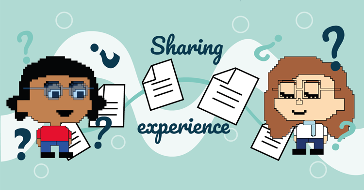
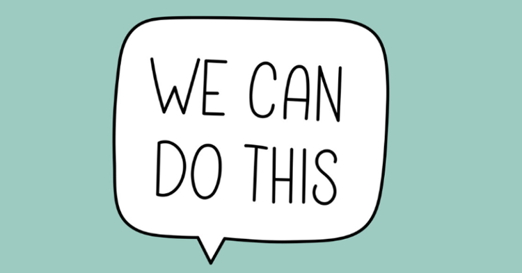

# Tips for programmers in interviews

## Some questions we got doing interviews as a junior developer in front-end, full stack, Ux developer and back-end  

This is a repository from one <b>bootcamper</b> to another <b>bootcamper</b>, in order to guide, help and share experiences along this journey after the course.  

❗❗ YOU CAN HELP TOO ❗❗  
Get in touch and be a contributor to this community 😉  

##  Personal questions:

- Why did you choose to be a developer?
- What was your first contact with this area? how interested?
- How do you give and receive feedback?
- How do you keep learning new things?
- Would you be willing to learn new things?
- Do you like to work in a team? What would be a perfect team for you?
- Have you worked in a team before? If yes, tell us about your experience
- What do you hope to achieve during the first year at @companyname?
- What is your motivation for joining the @companyname?
- How you gonna achieve an appropriate level of confidence after the first quarter in the company?

- Introduce yourself to us. What are your hobbies and interests? What are your professional goals? What makes you... you?  

##  Skill and experience questions:

(You need to give a real example about each topic)

- Working at Pace: You are resourceful and find solutions to problems whilst delivering results on time.
- Customer Focus: Understands and responds to the needs of our customers. Understands the impact you have on a customer and always strives to deliver a positive service.
- Communicating Openly: Communicates openly and effectively in a timely and positive manner.
- Driving Results & Performance: Takes responsibility for contributing to the business and understands how individual performance affects business success.
- Creating Improvements: Demonstrates commitment to driving high standards and performance improvements.
- Leading Self & Others: Motivates and empowers others in order to contribute to a positive environment for team effectiveness.  

##  Technical questions:

- How do backend and frontend communicate? How do you connect them? And how does the opposite happen?
- How does CRUD work? Examples? How do I get a crud ID?
- Difference between MongoDB and SQL? (relational and no relational database)
- What types of frameworks do you use on the front end?
- How to use things from the backend in the frontend?
- How to use an API in the backend?
- What kind of test would you do in this application(they give an example), explain why.
- How do we put your local project for others to see?
- As a UX testing. What kind of test would you do? How - - would you do?
- What is Agile? How its work?
- What is React? Explain the benifices of using it.
- How do you improve your code?
- What is CD/CI?
- How do you debug in Javascript and HTML?
- What does UX mean?
- How to improve the performance of a website?
- How to improve the accessibility and test?
- What is the difference between an object and an array?
- What is recursion in javascript?  

##  Technical exercises

The most of tech exercises I did was solving exercises like katas. Some examples:

- Solve an anagram ( to make a function that shows it is a true or false anagram)
- To do a factorial of numbers (like they give number 5 and you need to give a result 5 _ 4 _ 3 _ 2 _ 1 = 120)
- Copy a home page on CSS and Html from the company you are doing the interview (make sure you looked at their page)
- Make a page like youtube using HTML and Javascript (like they give me a list of videos and I need to show this on the page and make this work to play and to go next video)
- You need to make a function using recursion, you have a number parameter and you need to return the sum of all even numbers by this number. (like 8 should be 20 [2, 4, 6, 8 = 20 ])  

##  Questions to ask after the interview:

- <b> Why do you like working here? </b>
  Reason: To identify the strength areas (culture, salary, people etc) to read the person and understand if the interviewer is lying or is telling the truth.

- <b> Why are you hiring in software development? </b>
  Reason: To understand the current situation in that particular area of the company. Whether they fired somebody or expanded the team cause the project has grown.

- <b> Can you please tell me how the company evolved over recent years? </b>
  Reason: To understand how much the company has changed and identify the good things and bad things.

- <b>What are the plans for the company over the next five years? </b>
  Reason: To understand if their ambitions align with my career path.

- <b>What's the one thing I could do in this role to help your business succeed? </b>
  Reason: To be self-aware and understand how I can bring value to the organisation.

- <b>Could you tell me more about the team I would be part of? </b>
  Reason: To understand how they structure their team.

- <b>What are some areas of improvement in the team and where a new engineer can have an impact? </b>
  Reason: To identify the current challenges that the company is facing and how can i help them.  

##  These links can be helpful:

- [More question for interview](https://github.com/sudheerj/javascript-interview-questions) 
- [Good katas to practise](https://github.com/myjinxin2015/Katas-list-of-Training-JS-series) 

## Contributors 

- [Cintia Siqueira](https://github.com/ciisiq) 
- [Nicholas Gomis](https://github.com/NicholasGomis)
